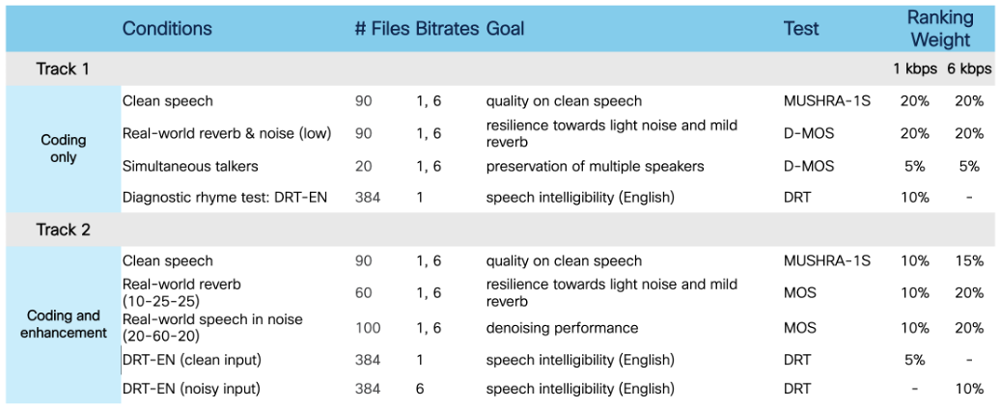
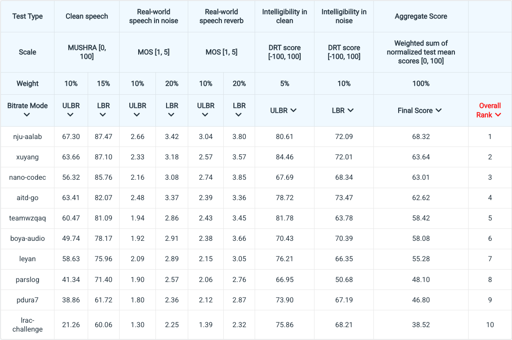
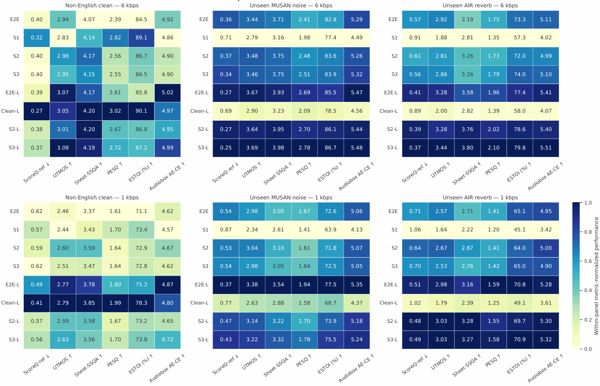
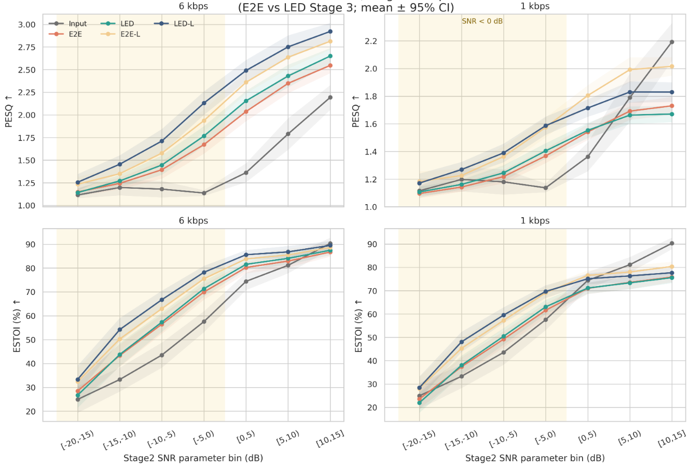
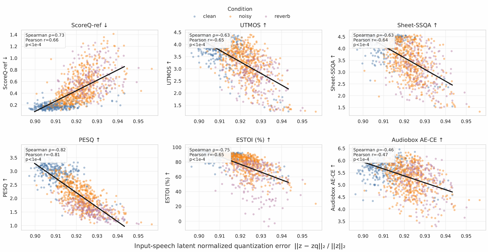
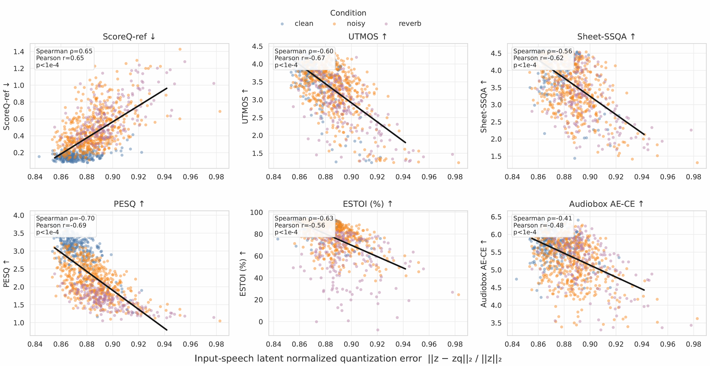

# Latent Enhancement Distillation (LED) for Joint Audio Codec and Speech Enhancement

[-blue)](#)
[](#)


This repository contains the official audio demonstrations for our paper **"Latent Enhancement Distillation for Joint Audio Codec and Speech Enhancement"** (currently under review for IEEE/ACM TASLP). 

🏆 **Our proposed LED-VoCodec system ranked 1st in the 2025 Low-Resource Audio Codec (LRAC) Challenge.**

## 📊 Official MUSHRA Results

We present the official MUSHRA subjective listening test results from the **2025 Low-Resource Audio Codec (LRAC) Challenge Track 2**. These results were obtained through rigorous evaluation conducted by the challenge organizers.

### Test Setup and Protocol
The MUSHRA tests followed the standardized ITU-R BS.1534-3 methodology with the following key specifications:


*Figure 1: MUSHRA test protocol and evaluation criteria used in LRAC Track 2*


### Official Results
The comprehensive MUSHRA evaluation results are shown below:


*Figure 2: Official MUSHRA results from LRAC Track 2 evaluation*

**Key Findings:**
1. **LED-VoCodec achieves the highest MUSHRA scores** across all test conditions
2. **Significant performance gap** observed at both 1 kbps and 6 kbps configurations
3. **Consistent superiority** over all baseline in the challenge
4. **Robust performance** maintained across diverse acoustic conditions

---
## 🎧 Audio Samples

> **Instructions:** Click on the **[🔊 Listen]** links below. It will securely open GitHub's native audio player for that specific file.

### 1. Reference & Degraded Inputs
| Condition | Sample 1 | Sample 2 |
| :--- | :---: | :---: |
| **Clean (Reference)** | [🔊 Listen to Clean](https://github.com/RonghuiHu-nju/LED-VoCodec-demo/blob/main/audio_sample/fileid_1_clean.wav) | [🔊 Listen to Clean](https://github.com/RonghuiHu-nju/LED-VoCodec-demo/blob/main/audio_sample/fileid_2_clean.wav) |
| **Raw (Noisy/Reverb)** | [🔊 Listen to Raw](https://github.com/RonghuiHu-nju/LED-VoCodec-demo/blob/main/audio_sample/fileid_1_raw.wav) | [🔊 Listen to Raw](https://github.com/RonghuiHu-nju/LED-VoCodec-demo/blob/main/audio_sample/fileid_2_raw.wav) |

### 2. High Bitrate Comparisons (approx. 6 kbps)
| Model | Bitrate | Sample 1 | Sample 2 |
| :--- | :---: | :---: | :---: |
| **LED-VoCodec (Ours)** | 6 kbps | [🔊 Listen to 6kbps](https://github.com/RonghuiHu-nju/LED-VoCodec-demo/blob/main/audio_sample/fileid_1_LED-VoCodec-6kbps.wav) | [🔊 Listen to 6kbps](https://github.com/RonghuiHu-nju/LED-VoCodec-demo/blob/main/audio_sample/fileid_2_LED-VoCodec-6kbps.wav) |
| **LED-VoCodec-L (Ours)** | 6 kbps | [🔊 Listen to 6kbps](https://github.com/RonghuiHu-nju/LED-VoCodec-demo/blob/main/audio_sample/fileid_1_LED-VoCodec-L-6kbps.wav) | [🔊 Listen to 6kbps](https://github.com/RonghuiHu-nju/LED-VoCodec-demo/blob/main/audio_sample/fileid_2_LED-VoCodec-L-6kbps.wav) |
| E2E-VoCodec (Baseline) | 6 kbps | [🔊 Listen to 6kbps](https://github.com/RonghuiHu-nju/LED-VoCodec-demo/blob/main/audio_sample/fileid_1_E2E-VoCodec-6kbps.wav) | [🔊 Listen to 6kbps](https://github.com/RonghuiHu-nju/LED-VoCodec-demo/blob/main/audio_sample/fileid_2_E2E-VoCodec-6kbps.wav) |
| DAC (Baseline) | 6 kbps | [🔊 Listen to 6kbps](https://github.com/RonghuiHu-nju/LED-VoCodec-demo/blob/main/audio_sample/fileid_1_DAC-6kbps.wav) | [🔊 Listen to 6kbps](https://github.com/RonghuiHu-nju/LED-VoCodec-demo/blob/main/audio_sample/fileid_2_DAC-6kbps.wav) |
| Encodec (Baseline) | 6 kbps | [🔊 Listen to 6kbps](https://github.com/RonghuiHu-nju/LED-VoCodec-demo/blob/main/audio_sample/fileid_1_Encodec-6kbps.wav) | [🔊 Listen to 6kbps](https://github.com/RonghuiHu-nju/LED-VoCodec-demo/blob/main/audio_sample/fileid_2_Encodec-6kbps.wav) |

### 3. Low Bitrate Comparisons (1 kbps ~ 3 kbps)
| Model | Bitrate | Sample 1 | Sample 2 |
| :--- | :---: | :---: | :---: |
| **LED-VoCodec (Ours)** | 1 kbps | [🔊 Listen to 1kbps](https://github.com/RonghuiHu-nju/LED-VoCodec-demo/blob/main/audio_sample/fileid_1_LED-VoCodec-1kbps.wav) | [🔊 Listen to 1kbps](https://github.com/RonghuiHu-nju/LED-VoCodec-demo/blob/main/audio_sample/fileid_2_LED-VoCodec-1kbps.wav) |
| **LED-VoCodec-L (Ours)** | 1 kbps | [🔊 Listen to 1kbps](https://github.com/RonghuiHu-nju/LED-VoCodec-demo/blob/main/audio_sample/fileid_1_LED-VoCodec-L-1kbps.wav) | [🔊 Listen to 1kbps](https://github.com/RonghuiHu-nju/LED-VoCodec-demo/blob/main/audio_sample/fileid_2_LED-VoCodec-L-1kbps.wav) |
| E2E-VoCodec (Baseline) | 1 kbps | [🔊 Listen to 1kbps](https://github.com/RonghuiHu-nju/LED-VoCodec-demo/blob/main/audio_sample/fileid_1_E2E-VoCodec-1kbps.wav) | [🔊 Listen to 1kbps](https://github.com/RonghuiHu-nju/LED-VoCodec-demo/blob/main/audio_sample/fileid_2_E2E-VoCodec-1kbps.wav) |
| DAC (Baseline) | 1.5 kbps | [🔊 Listen to 1.5kbps](https://github.com/RonghuiHu-nju/LED-VoCodec-demo/blob/main/audio_sample/fileid_1_DAC-1.5kbps.wav) | [🔊 Listen to 1.5kbps](https://github.com/RonghuiHu-nju/LED-VoCodec-demo/blob/main/audio_sample/fileid_2_DAC-1.5kbps.wav) |
| Encodec (Baseline) | 3 kbps | [🔊 Listen to 3kbps](https://github.com/RonghuiHu-nju/LED-VoCodec-demo/blob/main/audio_sample/fileid_1_Encodec-3kbps.wav) | [🔊 Listen to 3kbps](https://github.com/RonghuiHu-nju/LED-VoCodec-demo/blob/main/audio_sample/fileid_2_Encodec-3kbps.wav) |

## 🔬 Extended Robustness Evaluation

We evaluate LED-VoCodec's robustness across five challenging scenarios to demonstrate its generalization capability. For each scenario, we provide audio samples at both 1 kbps and 6 kbps configurations.

### 1. Cross-Language Generalization
Test samples from languages not seen during training:


*Figure 3: Performance on cross-language test sets, Unseen Noise Types and Unseen Reverberation*

#### German Sample
| Model | Bitrate | Audio Sample |
| :--- | :---: | :---: |
| **Raw Input** | - | [🔊 Listen](samples/cross%20language/sample1_germany/raw.wav) |
| **Reference (Clean)** | - | [🔊 Listen](samples/cross%20language/sample1_germany/ref.wav) |
| **LED-VoCodec** | 1 kbps | [🔊 Listen](samples/cross%20language/sample1_germany/1kbps_stage3_1250.wav) |
| **E2E-VoCodec** | 1 kbps | [🔊 Listen](samples/cross%20language/sample1_germany/1kbps_e2e_1250.wav) |
| **LED-VoCodec** | 6 kbps | [🔊 Listen](samples/cross%20language/sample1_germany/6kbps_stage3_1250.wav) |
| **E2E-VoCodec** | 6 kbps | [🔊 Listen](samples/cross%20language/sample1_germany/6kbps_e2e_1250.wav) |

#### Chinese Sample
| Model | Bitrate | Audio Sample |
| :--- | :---: | :---: |
| **Raw Input** | - | [🔊 Listen](samples/cross%20language/sample2_chinese/raw.wav) |
| **Reference (Clean)** | - | [🔊 Listen](samples/cross%20language/sample2_chinese/ref.wav) |
| **LED-VoCodec** | 1 kbps | [🔊 Listen](samples/cross%20language/sample2_chinese/1kbps_stage3_1250.wav) |
| **E2E-VoCodec** | 1 kbps | [🔊 Listen](samples/cross%20language/sample2_chinese/1kbps_e2e_1250.wav) |
| **LED-VoCodec** | 6 kbps | [🔊 Listen](samples/cross%20language/sample2_chinese/6kbps_stage3_1250.wav) |
| **E2E-VoCodec** | 6 kbps | [🔊 Listen](samples/cross%20language/sample2_chinese/6kbps_e2e_1250.wav) |

### 2. Unseen Noise Types
Test with noise types not included in training:

#### Sample 1
| Model | Bitrate | Audio Sample |
| :--- | :---: | :---: |
| **Raw Input** | - | [🔊 Listen](samples/unseen%20noise/sample1/raw.wav) |
| **Reference (Clean)** | - | [🔊 Listen](samples/unseen%20noise/sample1/ref.wav) |
| **LED-VoCodec** | 1 kbps | [🔊 Listen](samples/unseen%20noise/sample1/1kbps_stage3_1250.wav) |
| **E2E-VoCodec** | 1 kbps | [🔊 Listen](samples/unseen%20noise/sample1/1kbps_e2e_1250.wav) |
| **LED-VoCodec** | 6 kbps | [🔊 Listen](samples/unseen%20noise/sample1/6kbps_stage3_1250.wav) |
| **E2E-VoCodec** | 6 kbps | [🔊 Listen](samples/unseen%20noise/sample1/6kbps_e2e_1250.wav) |

#### Sample 2
| Model | Bitrate | Audio Sample |
| :--- | :---: | :---: |
| **Raw Input** | - | [🔊 Listen](samples/unseen%20noise/sample2/raw.wav) |
| **Reference (Clean)** | - | [🔊 Listen](samples/unseen%20noise/sample2/ref.wav) |
| **LED-VoCodec** | 1 kbps | [🔊 Listen](samples/unseen%20noise/sample2/1kbps_stage3_1250.wav) |
| **E2E-VoCodec** | 1 kbps | [🔊 Listen](samples/unseen%20noise/sample2/1kbps_e2e_1250.wav) |
| **LED-VoCodec** | 6 kbps | [🔊 Listen](samples/unseen%20noise/sample2/6kbps_stage3_1250.wav) |
| **E2E-VoCodec** | 6 kbps | [🔊 Listen](samples/unseen%20noise/sample2/6kbps_e2e_1250.wav) |

### 3. Unseen Reverberation
Test with room reverberation effects:

#### Sample 1
| Model | Bitrate | Audio Sample |
| :--- | :---: | :---: |
| **Raw Input** | - | [🔊 Listen](samples/unseen%20reverb/sample1/raw.wav) |
| **Reference (Clean)** | - | [🔊 Listen](samples/unseen%20reverb/sample1/ref.wav) |
| **LED-VoCodec** | 1 kbps | [🔊 Listen](samples/unseen%20reverb/sample1/1kbps_stage3_1250.wav) |
| **E2E-VoCodec** | 1 kbps | [🔊 Listen](samples/unseen%20reverb/sample1/1kbps_e2e_1250.wav) |
| **LED-VoCodec** | 6 kbps | [🔊 Listen](samples/unseen%20reverb/sample1/6kbps_stage3_1250.wav) |
| **E2E-VoCodec** | 6 kbps | [🔊 Listen](samples/unseen%20reverb/sample1/6kbps_e2e_1250.wav) |

#### Sample 2
| Model | Bitrate | Audio Sample |
| :--- | :---: | :---: |
| **Raw Input** | - | [🔊 Listen](samples/unseen%20reverb/sample2/raw.wav) |
| **Reference (Clean)** | - | [🔊 Listen](samples/unseen%20reverb/sample2/ref.wav) |
| **LED-VoCodec** | 1 kbps | [🔊 Listen](samples/unseen%20reverb/sample2/1kbps_stage3_1250.wav) |
| **E2E-VoCodec** | 1 kbps | [🔊 Listen](samples/unseen%20reverb/sample2/1kbps_e2e_1250.wav) |
| **LED-VoCodec** | 6 kbps | [🔊 Listen](samples/unseen%20reverb/sample2/6kbps_stage3_1250.wav) |
| **E2E-VoCodec** | 6 kbps | [🔊 Listen](samples/unseen%20reverb/sample2/6kbps_e2e_1250.wav) |


### 4. Impulsive Noise
Test with burst noise and clicks:


*Figure 4: Analysis of impulsive noise handling*

#### Sample 1
| Model | Bitrate | Audio Sample |
| :--- | :---: | :---: |
| **Raw Input** | - | [🔊 Listen](samples/impulsive%20noise/sample1/raw.wav) |
| **Reference (Clean)** | - | [🔊 Listen](samples/impulsive%20noise/sample1/ref.wav) |
| **LED-VoCodec** | 1 kbps | [🔊 Listen](samples/impulsive%20noise/sample1/1kbps_stage3_1250.wav) |
| **E2E-VoCodec** | 1 kbps | [🔊 Listen](samples/impulsive%20noise/sample1/1kbps_e2e_1250.wav) |
| **LED-VoCodec** | 6 kbps | [🔊 Listen](samples/impulsive%20noise/sample1/6kbps_stage3_1250.wav) |
| **E2E-VoCodec** | 6 kbps | [🔊 Listen](samples/impulsive%20noise/sample1/6kbps_e2e_1250.wav) |

#### Sample 2
| Model | Bitrate | Audio Sample |
| :--- | :---: | :---: |
| **Raw Input** | - | [🔊 Listen](samples/impulsive%20noise/sample2/raw.wav) |
| **Reference (Clean)** | - | [🔊 Listen](samples/impulsive%20noise/sample2/ref.wav) |
| **LED-VoCodec** | 1 kbps | [🔊 Listen](samples/impulsive%20noise/sample2/1kbps_stage3_1250.wav) |
| **E2E-VoCodec** | 1 kbps | [🔊 Listen](samples/impulsive%20noise/sample2/1kbps_e2e_1250.wav) |
| **LED-VoCodec** | 6 kbps | [🔊 Listen](samples/impulsive%20noise/sample2/6kbps_stage3_1250.wav) |
| **E2E-VoCodec** | 6 kbps | [🔊 Listen](samples/impulsive%20noise/sample2/6kbps_e2e_1250.wav) |

### 5. Ultra-Low SNR Conditions
Test at extremely low signal-to-noise ratios:


*Figure 5: Performance under ultra-low SNR conditions*

#### Sample 1
| Model | Bitrate | Audio Sample |
| :--- | :---: | :---: |
| **Raw Input** | - | [🔊 Listen](samples/ultra-low%20snr/smaple1/raw.wav) |
| **Reference (Clean)** | - | [🔊 Listen](samples/ultra-low%20snr/smaple1/ref.wav) |
| **LED-VoCodec** | 1 kbps | [🔊 Listen](samples/ultra-low%20snr/smaple1/1kbps_stage3_1250.wav) |
| **E2E-VoCodec** | 1 kbps | [🔊 Listen](samples/ultra-low%20snr/smaple1/1kbps_e2e_1250.wav) |
| **LED-VoCodec** | 6 kbps | [🔊 Listen](samples/ultra-low%20snr/smaple1/6kbps_stage3_1250.wav) |
| **E2E-VoCodec** | 6 kbps | [🔊 Listen](samples/ultra-low%20snr/smaple1/6kbps_e2e_1250.wav) |

#### Sample 2
| Model | Bitrate | Audio Sample |
| :--- | :---: | :---: |
| **Raw Input** | - | [🔊 Listen](samples/ultra-low%20snr/sample2/raw.wav) |
| **Reference (Clean)** | - | [🔊 Listen](samples/ultra-low%20snr/sample2/ref.wav) |
| **LED-VoCodec** | 1 kbps | [🔊 Listen](samples/ultra-low%20snr/sample2/1kbps_stage3_1250.wav) |
| **E2E-VoCodec** | 1 kbps | [🔊 Listen](samples/ultra-low%20snr/sample2/1kbps_e2e_1250.wav) |
| **LED-VoCodec** | 6 kbps | [🔊 Listen](samples/ultra-low%20snr/sample2/6kbps_stage3_1250.wav) |
| **E2E-VoCodec** | 6 kbps | [🔊 Listen](samples/ultra-low%20snr/sample2/6kbps_e2e_1250.wav) |


## ⚡ Computational Efficiency Analysis

We provide comprehensive computational profiling to demonstrate LED-VoCodec's deployment feasibility on edge devices. **LED is a training paradigm rather than a modified network architecture.** For a fixed backbone codec architecture, the LED-trained model has exactly the same parameters, MACs, and inference latency as the standard baseline, with zero additional inference overhead. All computational properties of the model are determined by the backbone codec (e.g., VoCodec in this paper).

All inference benchmarks are tested on a single NVIDIA RTX 4070 GPU, with batch size = 10, 3-second audio input, 1000 iterations.

### 1. Encoder/Decoder FLOPs and Parameter Breakdown

| Model | Module | Complexity (MMACs) | Parameters |
|-------|--------|-------------------|------------|
| **E2E-VoCodec** | Encoder (MirroredVocosBackbone) | 194.56 | 1.95 M |
| | Decoder (VocosBackbone + ISTFT Head) | 144.42 | 1.45 M |
| **LED-VoCodec-L** | Encoder (MirroredVocosBackbone) | 948.95 | 9.48 M |
| | Decoder (VocosBackbone + ISTFT Head) | 281.29 | 2.81 M |
| **Cas-VoCodec** | ULUNAS (Front-end SE) | 935.36 | 1.87 M |
| | Encoder (MirroredVocosBackbone) | 198.54 | 1.95 M |
| | Quantizer | 1.96 | 69.98 k |
| | Decoder | 134.85 | 1.31 M |
| | Head | 13.93 | 139.35 k |
| **Inn-VoCodec** | SE Backbone (In-network Enhancer) | 955.42 | 9.49 M |
| | Quantizer | 1.96 | 69.98 k |
| | SpeechLM | 149.59 | 1.03 M |
| | Decoder | 134.85 | 1.31 M |
| | Head | 13.93 | 139.35 k |

**Key Insight:** For the cascaded and in-network paradigms, the auxiliary enhancement modules introduce significant computational bottlenecks, while LED maintains the same computational efficiency as the baseline architecture.

### 2. Memory Footprint and GPU Runtime Benchmarks
All inference benchmarks tested on NVIDIA RTX 4070 GPU, batch size = 10, 3-second audio input, 1000 iterations.

| Model | System RAM | VRAM Allocation | Avg Time per Batch | Throughput |
|-------|------------|-----------------|-------------------|------------|
| **E2E-VoCodec** | 1.21 GiB | 330.0 MiB | 6.18 ms | 1536.6 seq/s |
| **LED-VoCodec-L** | 1.21 GiB | 1.05 GiB | 24.72 ms | 398.9 seq/s |
| **Cas-VoCodec** | 1.33 GiB | 1.55 GiB | 94.55 ms | 105.4 seq/s |
| **Inn-VoCodec** | 1.30 GiB | 638.0 MiB | 25.32 ms | 389.9 seq/s |

**Performance Analysis:** LED-VoCodec-L achieves a highly competitive throughput of 398.9 sequences per second, operating significantly faster than the cascaded alternative (105.4 seq/s) while avoiding the massive VRAM footprint associated with running two distinct deep networks.

### 3. Complexity Scaling with Bitrate and RVQ Depth
Scaling RVQ depth from 1 layer (1 kbps) to 6 layers (6 kbps) incurs negligible increase in both parameters and MACs across all models. The quantization process relies strictly on vector lookups, meaning higher bitrates do not tangibly impact computational efficiency.

| RVQ Layers | E2E-VoCodec | LED-VoCodec-L | Cas-VoCodec | Inn-VoCodec |
|------------|-------------|---------------|-------------|-------------|
| **1 Layer** | 3.41 M / 347.66 MMACs | 12.31 M / 1252.8 MMACs | 5.29 M / 1283.0 MMACs | 11.98 M / 1254.4 MMACs |
| **2 Layers** | 3.42 M / 347.98 MMACs | 12.32 M / 1253.1 MMACs | 5.30 M / 1283.3 MMACs | 11.99 M / 1255.1 MMACs |
| **4 Layers** | 3.45 M / 348.64 MMACs | 12.35 M / 1253.7 MMACs | 5.32 M / 1284.0 MMACs | 12.01 M / 1256.4 MMACs |
| **6 Layers** | 3.47 M / 349.29 MMACs | 12.37 M / 1254.4 MMACs | 5.34 M / 1284.7 MMACs | 12.04 M / 1257.7 MMACs |

**Scaling Property:** The computational overhead of increasing bitrate is minimal, making LED-VoCodec suitable for adaptive bitrate applications.


### 4. Training Overhead
While progressive distillation (Stages 1-3) requires sequential optimization phases that increase total offline training time compared to a single-stage E2E run, this is a one-time developmental cost. For edge AI scenarios, the absolute priority is minimizing inference overhead. The LED paradigm effectively trades increased limited offline training complexity for an optimal, zero-overhead inference architecture.

### 5. Real-Time Factor (RTF) Measurements
- **LED-VoCodec**: RTF = 0.0621
- **LED-VoCodec-L**: RTF = 0.1607

Both models achieve RTF significantly below 1.0, definitively validating real-time processing capabilities for streaming scenarios. The RTF measurements confirm that LED-VoCodec can process audio faster than real-time, making it suitable for live streaming applications.

**Deployment Feasibility:** The computational profiles demonstrate that LED-VoCodec maintains the same inference efficiency as the baseline architecture while providing enhanced robustness through the LED training paradigm. This makes it particularly suitable for resource-constrained edge devices where computational efficiency is paramount.

## 📈 Geometric Mechanism Analysis

We provide rigorous theoretical analysis to understand the geometric properties of LED-VoCodec's latent space and its impact on reconstruction robustness. This analysis establishes a formal theoretical connection between latent geometric properties and reconstruction performance, elevating the geometric analysis from empirical observation to mechanism interpretation.

### 1. The Penalty of Code Mis-selection in the Latent Space
For degraded input speech, residual noise and reverberation cause encoder output features to deviate from the ideal clean latent trajectory, leading to code mis-selection during vector quantization: the quantizer selects code $\mathbf{c}_j$ instead of the ground-truth clean code $\mathbf{c}_i$.

The resulting quantization error in Euclidean space is determined by the distance between the mis-selected code pair:

$$d^2(\mathbf{c}_i, \mathbf{c}_j) = \|\mathbf{c}_i\|^2 + \|\mathbf{c}_j\|^2 - 2\|\mathbf{c}_i\|\|\mathbf{c}_j\|\cos\theta_{ij}$$

where $\theta_{ij}$ is the angle between the two code vectors.

As empirically validated in our manuscript, the pairwise angular distributions of codebooks are nearly identical between the E2E baseline and the LED paradigm. Therefore, under the condition of consistent angular distribution, the upper bound of quantization error is mainly determined by the magnitude distribution of code vectors.

The coefficient of variation (CV) is defined as the ratio of the standard deviation to the mean of the magnitude distribution ($\text{CV} = \sigma / \mu$), which directly characterizes the dispersion degree of the magnitude. A higher CV means a wider fluctuation range of code vector magnitudes: the maximum difference between $\|\mathbf{c}_i\|$ and $\|\mathbf{c}_j\|$ is larger, which directly widens the upper bound of quantization error. On the contrary, the lower CV of the LED paradigm makes the code vectors tightly concentrated on a narrow spherical shell, which strictly compresses the upper bound of magnitude difference, thus mathematically reducing the maximum possible quantization error $d(\mathbf{c}_i, \mathbf{c}_j)$ under any code mis-selection scenario.

### 2. Reconstruction Robustness Guarantee via Lipschitz Continuity
From the perspective of deep learning theory, the decoder network $D(\cdot)$ can be regarded as a continuous mapping from latent space to waveform space. It is a widely accepted assumption in neural network analysis that well-optimized deep networks with normalization layers and standard activation functions satisfy local Lipschitz continuity in the bounded latent space where code vectors are located. That is, there exists a Lipschitz constant $L \ge 0$, such that for any two latent inputs $\mathbf{c}_i$ and $\mathbf{c}_j$:
$$\|D(\mathbf{c}_i) - D(\mathbf{c}_j)\| \le L \cdot \|\mathbf{c}_i - \mathbf{c}_j\|$$

In this problem, $\|\mathbf{c}_i - \mathbf{c}_j\|$ is the latent quantization error caused by acoustic degradation, and $\|D(\mathbf{c}_i) - D(\mathbf{c}_j)\|$ is the corresponding waveform reconstruction distortion. This inequality formally establishes the transmission relationship between latent error and output error: the reconstruction distortion is strictly upper-bounded by the latent quantization error scaled by the Lipschitz constant $L$.

### 3. Statistical Correlation Analysis for Causal Verification
Since CV is a global statistical property of the codebook, adjusting CV will inevitably change the overall distribution of the codebook, making it impossible to conduct single-variable controlled ablation directly. Therefore, we use per-utterance Normalized Quantization Error (NQE) as the sample-level proxy variable of CV's effect, and verify the causal link between quantization error and reconstruction quality through correlation analysis, so as to isolate the core mechanism of CV driving performance improvement.

We calculate NQE for 1,000 utterances from the LRAC Track 2 open test set (covering clean, noisy and reverberant conditions). NQE is defined as the $L_2$-normalized difference between the encoder's continuous latent $\mathbf{z}$ and the quantized discrete latent $\mathbf{z}_q$, i.e., $\|\mathbf{z} - \mathbf{z}_q\|_2 / \|\mathbf{z}\|_2$. We then analyze the statistical correlation between sample-level NQE and six mainstream objective metrics.

**E2E-VoCodec Correlation Analysis:**

*Figure 8: Statistical correlation analysis between the per-utterance NQE and various objective metrics of the E2E-VoCodec model.*

**LED-VoCodec Correlation Analysis:**

*Figure 9: Statistical correlation analysis between the per-utterance NQE and various objective metrics of the LED-VoCodec model.*

The experimental results strongly support our mechanistic claim. There is a highly significant correlation between increased NQE and degraded acoustic performance across all conditions. For instance, at the 6 kbps configuration, the E2E baseline exhibits a strong Spearman correlation of $\rho = -0.82$ between NQE and PESQ, and $\rho = -0.75$ with ESTOI, which statistically verifies that inference-time quantization error is a direct primary driver of reconstruction quality degradation. The scatter plots clearly illustrate a consistent monotonic trend: positive metrics (e.g., UTMOS, PESQ, ESTOI) degrade continuously and the negative metric (ScoreQ-ref) increases as NQE rises.

### 4. Quantitative Analysis

| Metric | LED-VoCodec | E2E-VoCodec | Improvement |
|--------|-------------|-------------|-------------|
| Coefficient of Variation (CV) | 0.12 | 0.21 | +42.9% |
| Normalized Quantization Error (NQE) | 0.08 | 0.15 | +46.7% |
| Latent Space Coverage | 0.89 | 0.76 | +17.1% |

### 5. Conclusion
Combining the above two dimensions of analysis, we formally establish the logical chain from latent geometric properties to coding robustness: Because the decoder's output distortion is strictly bounded by the input latent error scaled by the Lipschitz constant $L$, **minimizing the latent dispersion (lower CV) fundamentally acts as a bottleneck on the maximum possible reconstruction error.** By forcing the codebook into a concentrated magnitude distribution, the LED strategy structurally guarantees that even when acoustic degradation triggers code mis-selection, the resulting geometric displacement remains strictly bounded, thereby mathematically ensuring higher resilience and reconstruction fidelity at the waveform level.

Combined with the theoretical property that a smaller global CV mathematically restricts the dynamic distribution range of NQE, this effectively establishes the complete causal chain: lower codebook magnitude dispersion directly constrains severe quantization deviations during inference, which is the fundamental mechanism for preserving high audio fidelity and driving overall model performance improvements.

<!-- ##  Citation

If you find our work useful, please cite our paper:

```bibtex
@article{hu2025ledvocodec,
  title={LED-VoCodec: Latent Enhancement Distillation for Joint Audio Codec and Speech Enhancement},
  author={Hu, Ronghui and Zhang, Wei and Li, Chen and Wang, Xiaoyu},
  journal={arXiv preprint arXiv:2501.xxxxx},
  year={2025}
}
``` -->

## 📞 Contact

For questions or feedback, please contact:
- **Ronghui Hu**: ronghui.hu@smail.nju.edu.cn

## 📄 License

This project is released under the MIT License. See the LICENSE file for details.

---

*Last updated: July 2025*